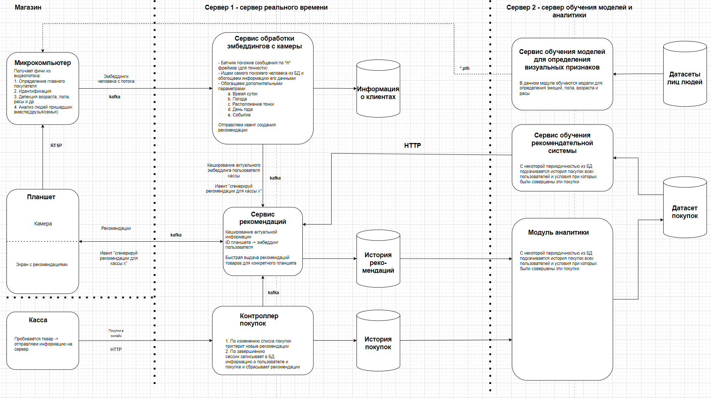

# Общие схемы и модели

## Общие зависимости

    python3.11

## Подготовка проекта

    git clone ____
    cd ____
    python -m venv venv
    source venv/bin/activate

В каждом сервисе:

    pip install -r requirements.txt
    cd -

Затем остальные requirements:

    pip install -r requirements.txt
    # Поставить локально общий пакет (если требуется его править и видеть результат до пуша в репозиторий):
    pip install -e ../api

Если Pycharm не видит установленную библиотеку api(grifon):
    
    File -> Settings -> Project -> Project Dependencies -> Выбрать текущий проект -> Поставить галочку на api

___

Архитектура проекта
